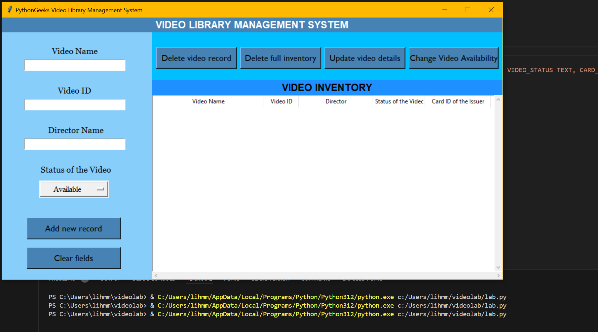
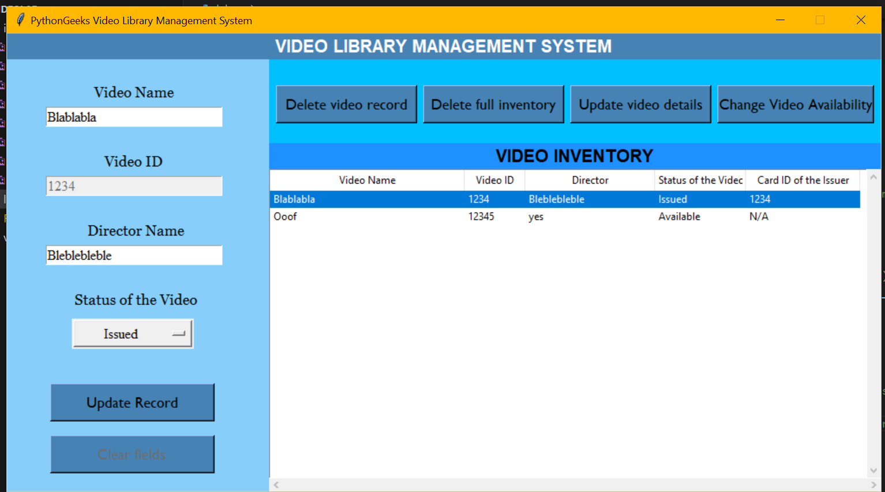

# Video Library Management System

The Video Library Management System is a Python application that allows users to store and manage a vast source of videos. The system can store any kind of video data, be it a movie, a TV show, a TikTok video, a meme video, or even a streamer library. Users can choose how they want to use the video library management system.

## Objective

- **Organisation**: A video library management system can help users organise their video collections by storing information about each video, such as its name, ID, director, and status.
- **Efficiency**: The system can automate tasks such as adding, updating, and deleting video records, making it more efficient than manual methods.
- **Accessibility**: The system can provide easy access to video records, allowing users to quickly find and view information about a particular video.
- **Integration**: The system can be integrated with other applications, such as media players or video streaming services, to provide a seamless user experience.
- **Customisation**: The system can be customised to meet the specific needs of different users, such as libraries, schools, businesses, streamers, influencers.

## Project Inspiration

This project was inspired by the Library Management System Project in Python from [Python Geeks](https://pythongeeks.org/python-library-management-system-project/). I've adapted their comprehensive guide, originally focused on managing books, to suit my need for video management. By repurposing their foundational concepts and methodologies, I was able to streamline the development process while ensuring robust functionality.

## Code Creation

**SQLite Database Connection and Table Creation**
The code starts by connecting to an SQLite database named video_library.db. If the Library table does not exist in the database, it creates one with columns for video name, ID, director name, video status, and card ID.

**GUI Components and Layout**
The GUI window is created using Tkinter, with a title "Video Library Management System" and a fixed size of 1010x530 pixels. The main window is divided into three frames: left_frame, RT_frame (right top frame), and RB_frame (right bottom frame). Each frame contains various widgets such as labels, entry fields, buttons, and a tree view.

## Functions for Database Operations

- **get_card_id()**: Prompts the user to enter an issuer card ID using a dialog box.
- **display_records()**: Retrieves records from the Library table and displays them in the tree view.
- **clear_fields()**: Clears the input fields (video ID, name, director, and card ID) and deselects any selected record in the tree view.
- **clear_and_display()**: Clears the input fields and displays records, used after adding or updating records.
- **add_record()**: Adds a new record to the Library table based on user input. It prompts the user to enter an issuer card ID if the video status is 'Issued'.
- **update_record()**: Updates an existing record in the Library table based on user input.
- **view_record()**: Displays details of a selected record from the tree view in the input fields.
- **remove_record()**: Deletes a selected record from the Library table and tree view.
- **delete_inventory()**: Deletes all records from the Library table and clears the tree view.
- **change_availability()**: Changes the availability status of a video and updates the database. If a video is issued, it prompts the user to confirm if the video has been returned.
  
**GUI Widgets and Bindings**
Labels, entry fields, dropdown menus, buttons, and a tree view are used to interact with the user and display data. Various buttons are placed in the GUI for adding, updating, deleting records, and changing video availability. The tree view displays records fetched from the database. Horizontal and vertical scrollbars are added to the tree view for navigation.

## Features

- **Add New Record**: Users can add new videos to the library with details such as video name, video ID, director name, and status of the video.
- **View Record**: Users can view the details of a selected video from the library.
- **Update Record**: Users can update the details of a video in the library.
- **Delete Video Record**: Users can delete a specific video record from the library.
- **Delete Full Inventory**: Users can delete all video records from the library.
- **Change Video Availability**: Users can change the availability status of a video in the library.

## Features to Implement

- **User Authentication**: Implement user authentication to allow secure access to the video library.
- **Search Functionality**: Add a search feature to allow users to search for videos in the library using various parameters.
- **Video Categories**: Implement video categorization based on genres, directors, etc.
- **User Preferences**: Add a feature to track user preferences and suggest videos accordingly.
- **Added Date**: Add a feature to track the date video was added to the library.
- **Views**: Track how much views each video added had.
- **Integration**: The system can be integrated with other applications, such as media players or video streaming services, to provide a seamless user experience.
- **Reservation System**: Implement a reservation system to allow users to reserve videos that are currently checked out.
- **Analytics and Reporting**: Incorporate analytics and reporting features to track usage statistics, popular videos, borrowing trends, and other insights.
- **Integration with External APIs**: Integrate with external APIs (such as movie databases or streaming services) to automatically retrieve and populate video metadata.
- **Mobile Application**: Develop a mobile application companion for the Video Library Management System, allowing users to access the library, search for videos, check availability, and manage their accounts from their smartphones or tablets.

## Requirements

- Python 3.x
- sqlite3
- tkinter

## Testing

The application has been manually tested to ensure all features work as expected.

## Deployment

The application was deployed on Heroku using the following steps:

1. **Commit the code to Git**: Ensured all code is added and committed to Git.
2. **Create a new app on Heroku**: Log in to Heroku, go to the dashboard, and created a new app.
3. **Connect the Heroku app to the GitHub repository**: In the app settings on Heroku, under the "Deploy" tab, connected the app to the corresponding GitHub repository.
4. **Deploy the app**: Still under the "Deploy" tab on Heroku, scrolled down to "Manual Deploy", select the main branch, then clicked "Deploy Branch".
5. **Open the app**: Once deployment was completed, clicked on "Open app" at the top right of the Heroku dashboard to open the deployed application.

## INTERFACE

**Video Library System**

**Do you Want to Add Message**

**New Record Added Message**

**Delete Full Inventory Message**

**Delete Successful Message**

**Change Availability - Issuer ID Message**

**To View Record Must Select Message**

**Updating Record Message**

## Credits

This project was made possible through the following references, which provided valuable insights and knowledge:

- **[Python Geeks](https://pythongeeks.org/python-library-management-system-project/#:~:text=About%20the%20Python%20Library%20Management%20System%20project%3A&text=To%20build%20this%2C%20you%20will,basic%20understanding%20of%20messagebox%20module.):** This resource was fundamentally important in understanding the Python Library Management System project, providing essential guidance and insights throughout the development process.

- **[Python Official Documentation](https://www.python.org/about/gettingstarted/):** The official Python documentation was instrumental in learning the basics of Python programming language and understanding its features and functionalities.

- **[Python Land](https://python.land/python-tutorial#google_vignette):** Python Land provided an in-depth Python tutorial, covering various topics and concepts essential for building Python applications.

- **[Dataquest](https://www.dataquest.io/blog/how-to-analyze-survey-data-python-beginner/):** This resource offered valuable guidance on data analysis techniques in Python, which proved useful in analyzing survey data for this project.

- **[W3Schools](https://www.w3schools.com/python/python_examples.asp):** W3Schools provided numerous Python examples and tutorials, offering practical insights into Python programming.

- **[pytest Documentation](https://docs.pytest.org/en/8.0.x/):** The pytest documentation served as a comprehensive guide to writing and running tests in Python, ensuring the reliability and correctness of the project code.

- **[Real Python](https://realpython.com/solid-principles-python/):** Real Python's articles on SOLID principles in Python were invaluable in understanding software design principles and applying them effectively in the project.

- **[DataFlair](https://data-flair.training/blogs/library-management-system-python-project/):** DataFlair's tutorial on building a Library Management System project in Python provided practical implementation insights and best practices.

- **YouTube tutorials:**
These YouTube tutorials provided step-by-step guidance on building Python GUI applications using Tkinter, enhancing understanding and implementation skills.
  - [Tutorial 1](https://www.youtube.com/watch?v=yZUL7IFA324)
  - [Tutorial 2](https://www.youtube.com/watch?v=o5uJrvQDrvU)

- **[Tkinter Documentation](https://docs.python.org/3/library/tkinter.html):** The official Tkinter documentation was an essential resource for learning about Tkinter widgets, layouts, and event handling.

- **[Tkinter.ttk Documentation](https://docs.python.org/3/library/tkinter.ttk.html):** The Tkinter.ttk documentation provided additional insights and examples for using themed Tkinter widgets, enhancing the appearance and functionality of the GUI.

- **[SQLite3 Documentation](https://docs.python.org/3/library/sqlite3.html):** The SQLite3 documentation offered insights into using SQLite databases in Python, facilitating the implementation of database operations in the project.

- **[W3Schools SQL Tutorial](https://www.w3schools.com/python/python_mysql_create_table.asp):** This tutorial provided guidance on creating SQL tables in Python, which was helpful in setting up the database schema for the project.

- **[Tutorialspoint SQL Tutorial](https://www.tutorialspoint.com/python_data_access/python_sqlite_create_table.htm):** Tutorialspoint's SQL tutorial offered additional insights and examples for creating SQL tables in Python.

## Conclusion

The Python Library Management System project was a challenging but rewarding project that gave me the chance to learn more about Python programming, GUI development, and database administration. Through the combination of comprehensive research, learning, and practical application, this project facilitated a more profound comprehension of Python's functionalities and its utilisation in practical situations.

By leveraging resources such as Python Geeks, official documentation, tutorials, and online platforms, I was able to overcome obstacles and successfully develop a functional system for managing a library's inventory. The project encompassed key concepts such as user interface design using Tkinter and database management with SQLite.

This project serves as a solid foundation for further exploration and refinement of Python programming skills. The experience gained from building this Library Management System will be invaluable in tackling more complex projects and honing expertise in software development.
